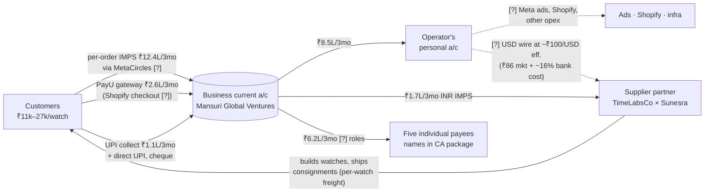

# Timelabs Co — Business & Money Flow

*The canonical explainer of how the business works and how money moves — written for the
CA / bookkeeper, kept as the agent's memory of the subject. Companion to `business-context.md`
(which describes the tooling; this file describes the commerce).*

**Status: DRAFT v0.3 — repo facts + the business current-account statement (24 May – 24 Aug
2026). Items marked `[?]` are open questions awaiting the owner. This repo copy is
deliberately redacted: individual payee names, the proprietor's details, and account
numbers stay out of git — the full-detail version lives in the CA package the owner shares
directly. Statement figures cover the one account shared so far, not the whole business.**

*Last updated 2026-08-24.*

---

## 1. What the business is

**Timelabs Co** (storefront `timelabsco.in`, Shopify store `xd2fwj-1h.myshopify.com`) is an
India-based direct-to-consumer brand selling **Seiko watch-mod parts and complete custom
builds** — homage/mod watches (Datejust, Royal Oak, Nautilus, Aquanaut styles) built on Seiko
movements (NH35 and similar). Typical selling price **₹11,000–₹27,000** per watch. Market is
India; the store runs on Shopify (Basic plan), priced in INR.

The watches are **built by a supplier partner — Hannan (the "TimeLabsCo × Sunesra"
collaboration)** — not in-house. Timelabs takes the order, the supplier builds and ships,
Timelabs handles the customer.

## 2. The entity and the bank account (confirmed)

- Trading brand **Timelabs Co** operates through **Mansuri Global Ventures**, a **sole
  proprietorship** (proprietor details withheld here — in the CA package).
- One **business current account** (Yes Bank, Mumbai) receives customer money; it is swept
  nearly empty on a rolling basis, largely into the operator's personal account.
- `[?]` GST registration status; whether "Timelabs Co" is a registered trade name; who
  files the proprietor's ITR today.
- `[?]` Relationship on paper with the supplier partner (pure vendor vs. profit share).

## 3. How orders (revenue) arrive — three channels

All three land in one unified order database with one running order number.

1. **Shopify website** (`timelabsco.in`) — synced automatically every 5 minutes.
2. **WhatsApp** — customers message directly; logged manually via the order form.
3. **Manual order form** (`/ops/order-form.html`) — staff paste customer details.

Order lifecycle: `new → acknowledged → paid → in transit → assembled → shipped → delivered`
(+ `cancelled`). "Paid" is an explicit, tracked stage. **Stock builds** (built for inventory,
not against a customer order) are deliberately *not* counted as sales.

## 4. How the money comes in (confirmed rails)

Money reaches the business account through **five rails**. Figures are the 3-month window
24 May – 24 Aug 2026, this account only.

| Rail | 3-mo total | Count | What it is |
|---|---|---|---|
| **MetaCircles Technologies Pvt Ltd** (IMPS via RBL Bank) | **₹12,39,349** | 85 | Per-order-sized credits (₹11k–13k each — exactly watch-priced). The **largest revenue rail by far (~75%)**. `[?]` Which service this is — COD remittance / checkout provider / payment links — and its fee. |
| **PayU Payments Pvt Ltd** (NEFT settlements) | ₹2,57,280 | 11 | Payment-gateway settlements — presumably behind Shopify checkout `[?]` (settlement cycle, MDR). |
| **UPI Collection Settlement** (bank CBS) | ₹1,12,900 | 6 | Batched UPI collections settled by the bank — `[?]` which QR/VPA (WhatsApp orders?). |
| Cheque deposit | ₹40,975 | 1 | `[?]` one-off — what was this? |
| Direct UPI from a customer | ₹6,500 | 1 | Customer paid the account's UPI handle directly. |
| **Total in** | **₹16,57,004** | 104 | |

MetaCircles monthly trend: May (partial) ₹1.24L → Jun ₹3.04L → Jul ₹5.04L → Aug (to 24th)
₹3.07L — growing.

- `[?]` Advance vs. full payment on custom builds; whether COD is offered.

## 5. How the money goes out

### 5.1 From the business account (confirmed, same window)

Total out ₹16,44,635 — the account nets to roughly zero (+₹12k over the period).

| Destination | 3-mo total | Count | Role |
|---|---|---|---|
| **Operator's personal account** | **₹8,51,300** | 23 | `[?]` What it funds — ads/Shopify/supplier wires paid personally, drawings, or both. Critical for the books. |
| **Supplier partner (Hannan side)** | ₹1,73,450 | 7 | Paid by **domestic INR IMPS** |
| **Five individual payees** (names in CA package) | ₹6,19,500 | 17 | `[?]` roles — parts suppliers, refunds, family, salaries? |
| Bank charges + GST on them | ~₹460 | 26 | IMPS fees etc. |

Notably **absent** from this account: Meta ads, Shopify subscription, forex/outward
remittance, courier bills, rent/salaries. Those must run through another account `[?]` —
presumably personal (statements to come).

### 5.2 Supplier cost of goods — the USD story (from the Ledger)

- Supplier invoices are raised in **USD**; historically paid from an Indian account at an
  **effective ≈ ₹100/USD** vs ~₹86 market over 2025-06→2026-06 — i.e. **~16% banking cost**
  (forex markup + transfer fees) on top of goods, tracked separately in the Ledger.
- Uploaded supplier invoices are treated as **already paid** (owner's rule).
- `[?]` How this squares with the INR IMPS payments to the supplier seen in the statement:
  did the method change, or do both run in parallel (wires from the personal account)?
  Which channel carries the USD leg (bank wire / Wise / other), from which account?
- `[?]` Where goods ship from; customs/IGST treatment of inbound consignments.

### 5.3 Inbound freight (consignments)

Builds are grouped into **consignments/shipments**; each consignment has a total shipping
cost, giving a **per-watch freight cost** (total ÷ count). Part of landed cost.

### 5.4 Outbound shipping to customers

`[?]` Which courier(s), who pays, COD charges — not visible in this account.

### 5.5 Operating costs

Shopify subscription (Basic), Meta ads, VPS/domain, AI/API credits. None debit the business
account — `[?]` confirm they're paid personally and whether they're claimed as business
expenses today.

## 6. Margin picture (how the Ledger computes it)

True landed cost per watch = **USD invoice total × effective rate (≈₹100)** + **per-watch
consignment freight**. Margin = selling price − landed cost − outbound shipping − channel
costs (gateway/remitter fees). The Ledger deliberately splits "goods at market rate" from
"cost of banking" so the banking overhead stays visible.

## 7. Refunds, cancellations, edge cases `[?]`

- `[?]` Refund mechanics per rail (and whether any outbound person-payments are refunds).
- `[?]` A cancelled order after parts are bought (specs lock once paid).
- `[?]` Warranty/replacement cost handling.

## 8. Money-flow diagram (current draft)

Dashed lines = suspected but unconfirmed (awaiting the other account statements).

## 9. Open questions for the owner

1. **MetaCircles Technologies** — what service is this? It's ~75% of money in.
2. **The five individual payees** (₹6.2L combined) — suppliers, refunds, family, salaries?
3. **The ₹8.5L to the personal account** — what does it fund?
4. **Supplier payments now** — INR IMPS, USD wires at ~₹100 effective, or both? From where?
5. **Entity & tax** — GST registered? Trade name registered? Who files today?
6. **PayU** — confirm it's the Shopify gateway; settlement cycle and MDR.
7. **Remaining statements** — personal account(s) for the same window, to complete outflows.

---

*Raw statement parsing and the unredacted detail live outside the repo. When the owner
answers, facts replace `[?]` markers; keep the diagram in sync; then produce the polished CA
version (one-pager + chart, PDF hosted on the domain).*
